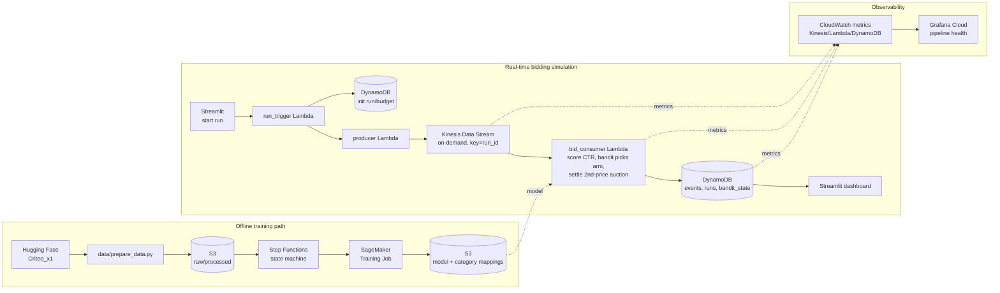

# Ad Auction Bid/CTR Optimization Simulator

_Real-time bidding, powered by AWS_

**[Live dashboard →](https://ad-auction-optimizer-gmdqwa5ywh9pljqi7t7buw.streamlit.app)**

A Thompson Sampling bandit learns the best bid multiplier under a budget
constraint, bidding into a simulated second-price auction driven by a
LightGBM CTR model trained on real Criteo ad-click data. Historical
impressions are replayed onto a Kinesis stream and scored live by a Lambda
consumer, then settled and persisted to DynamoDB — the "real-time" part is
genuine, not a Python loop dressed up to look like one.

## What this demonstrates

- **Event-driven architecture, not batch** — Kinesis → Lambda → DynamoDB. A
  single Lambda invocation, triggered directly off the stream, handles a
  full score → decide → settle → persist cycle per impression.
- **A real ML model, not a toy one** — LightGBM trained on 160k rows of the
  actual Criteo Kaggle Display Advertising Challenge dataset, benchmarked
  against a logistic-regression baseline (hashed categoricals, the same
  trick production CTR systems use at real scale). AUC 0.760 vs. 0.744
  baseline on a 40k-row holdout.
- **Sequential decision-making under uncertainty** — a Thompson Sampling
  multi-armed bandit picks the bid multiplier, learning online from auction
  outcomes rather than using a fixed heuristic. Tracked against the
  standard bandit regret metric (cumulative reward vs. the best fixed arm
  in hindsight).
- **Infrastructure as code, cost-consciously designed** — everything is
  Terraform. Kinesis runs in on-demand capacity mode and DynamoDB in
  on-demand billing specifically to avoid the ~$10-11/month per idle
  Kinesis shard that provisioned mode would cost between demo sessions;
  there's no SageMaker endpoint, only an on-demand Training Job. Standing
  cost between sessions is close to $0.
- **Correctness caught before it shipped, not after** — LightGBM needs a
  consistent category→integer-code mapping between training and inference;
  an early version of this pipeline silently mismatched them (a `pandas`
  dtype-mixing quirk in `.iterrows()` mangled category values on their way
  to JSON), which would have quietly degraded every prediction without
  ever raising an error. Caught by re-deriving AUC/LogLoss through the
  exact inference code path and diffing against training metrics — see
  `model/train_ctr_model.py`'s comments for the specifics.

## Architecture



Kinesis's partition key is `run_id`, so every event for one simulation run
lands on the same shard in order — a single Lambda invocation processes
them sequentially, which is what keeps the per-run bandit state's
read-modify-write safe without needing distributed locking.

## Tech stack

Python · AWS Lambda · Kinesis · DynamoDB · S3 · Step Functions · SageMaker ·
Terraform · LightGBM · Streamlit · Grafana Cloud

## Model & bidding approach

- **CTR model**: LightGBM with native categorical support, benchmarked
  against a hashed-feature logistic regression baseline — trained on 160k
  rows of Criteo data, evaluated on a 40k-row holdout (AUC 0.7597 vs. 0.7437
  baseline, LogLoss 0.4768 vs. 0.5029).
- **Bid decision**: Thompson Sampling over a small set of bid multipliers,
  tracked via Welford's online mean/variance per arm — each auction outcome
  updates the belief distribution live, no offline retraining loop needed to
  adapt within a run.
- **Auction settlement**: standard second-price (Vickrey) rules — highest
  bid wins, pays the second-highest bid (or nothing, if there are no
  competitors that impression).

## Why this project

Ad-tech and analytics-adjacent interviews ask about bid optimization, CTR
prediction, and auction mechanics as first-class topics — most portfolio
answers to that are a static notebook. This one is a live system: a Kinesis
stream that's actually streaming, a Lambda that's actually invoked per
event, and a bandit that's actually updating its beliefs against real
infrastructure, not a for-loop pretending to be one.

The emphasis isn't the dashboard — it's the plumbing underneath it: an
event-driven pipeline where one invocation does score → decide → settle →
persist per impression, a cost model that keeps standing cost near zero
between demo sessions without faking the "real AWS" part, and a bandit
whose online learning is visible on a live chart rather than just asserted
in a README.

## Repo structure

```
infra/                 Terraform - every AWS resource, plus the Docker-based
                        scripts that build Lambda dependency layers matching
                        Lambda's actual runtime (see infra/lambda.tf's
                        header comment for why that matters).
data/                   Pulls a Criteo CTR sample from Hugging Face (no
                        login required) - runs once, locally.
model/                  Trains the LightGBM CTR model + a logistic
                        regression baseline; outputs the model, metrics,
                        category encoding mappings, and the holdout
                        impression stream the simulation replays.
simulation/             Pure, dependency-free logic: second-price auction
                        settlement and the Thompson Sampling bandit. No AWS
                        imports - fully unit-testable, and shared by both
                        the Lambda functions and the test suite.
lambda_functions/       bid_consumer (Kinesis-triggered scorer/settler),
                        run_trigger (starts a run), producer (streams
                        holdout impressions onto Kinesis).
dashboard/              Streamlit app - CTR model performance (static,
                        reads bundled model artifacts) and live auction
                        simulation (reads DynamoDB).
monitoring/             Grafana Cloud dashboard definition (CloudWatch
                        panels for Kinesis/Lambda/DynamoDB).
tests/                  Unit tests for simulation/ - no AWS credentials
                        needed, matches what CI runs.
```

## Running it yourself

```bash
# 1. Prepare data + train the model (local, one-time)
python -m venv .venv && source .venv/bin/activate
pip install -r requirements.txt
python -m data.prepare_data --n-rows 200000
python -m model.train_ctr_model

# 2. Build the Lambda dependency layer (Docker required)
./infra/build_layers.sh

# 3. Provision AWS infrastructure (one apply - Terraform only needs the S3
#    bucket resource to exist to wire up the Lambda env vars, not the
#    objects inside it)
cd infra && terraform init && terraform apply
cd ..

# 4. Upload the already-trained model + package the SageMaker training
#    entrypoint (only needed again if you retrain via Step Functions)
aws s3 cp model/ctr_model.txt "s3://$(terraform -chdir=infra output -raw s3_bucket)/models/latest/ctr_model.txt"
aws s3 cp model/category_mappings.json "s3://$(terraform -chdir=infra output -raw s3_bucket)/models/latest/category_mappings.json"
aws s3 cp model/holdout.jsonl "s3://$(terraform -chdir=infra output -raw s3_bucket)/models/latest/holdout.jsonl"
./infra/package_training_code.sh "$(terraform -chdir=infra output -raw s3_bucket)"

# 5. Smoke test: trigger a run directly, bypassing the dashboard
aws lambda invoke --function-name "$(terraform -chdir=infra output -raw run_trigger_function_name)" \
  --payload '{"budget": 100, "value_per_click": 2.0, "n_impressions": 200}' --cli-binary-format raw-in-base64-out /tmp/out.json && cat /tmp/out.json

# 6. Tear down between demo sessions (avoids any standing cost)
cd infra && terraform destroy
```

Then deploy `dashboard/app.py` to Streamlit Community Cloud, pointing its
secrets at the `streamlit_readonly` IAM credentials from `terraform output`
plus the DynamoDB table names / Lambda function name from the same output.

### Grafana Cloud (pipeline observability)

Separate from the Streamlit dashboard: a read-only view of the AWS pipeline
itself (Kinesis/Lambda/DynamoDB CloudWatch metrics), for watching the
infrastructure during a demo run rather than the simulation results.

1. Sign up for a [Grafana Cloud](https://grafana.com/products/cloud/) free
   tier account (skip if you already have one).
2. In your stack, add a CloudWatch data source (**Connections → Add new
   connection → Amazon CloudWatch**) using the **Access & secret key** auth
   method and the `grafana_cloudwatch_readonly` IAM credentials from
   `terraform output grafana_cloudwatch_readonly_access_key_id` /
   `terraform output -raw grafana_cloudwatch_readonly_secret_access_key`,
   region `us-east-1`.
3. **Dashboards → New → Import**, paste the contents of
   `monitoring/grafana-dashboard.json`, and select the CloudWatch data
   source when prompted.

Not meant to run continuously - check it during/after a simulation run,
there's nothing to watch between sessions.

## What I'd change for a real production deployment

- Bake a custom SageMaker training container instead of the built-in
  scikit-learn container in script mode (installs `lightgbm` via
  `requirements.txt` at container start) - faster to stand up, but a real
  production pipeline would bake a purpose-built image instead.
- Put API Gateway (with real request auth) in front of `run_trigger`
  instead of the dashboard invoking it directly via `boto3` with IAM
  credentials - fine for a single-operator demo, not for a multi-user
  product.
- Replace `bandit_state`'s simple read-modify-write per event with
  DynamoDB conditional writes - safe today because Kinesis's
  partition-key-per-run_id guarantees one shard (and therefore effectively
  one active writer) per run, but a genuinely multi-writer design would
  need optimistic locking.
- Swap the Grafana Cloud dashboard's on-demand/no-endpoint cost model for
  an always-on monitoring stack once there's a production SLA to actually
  watch continuously.
